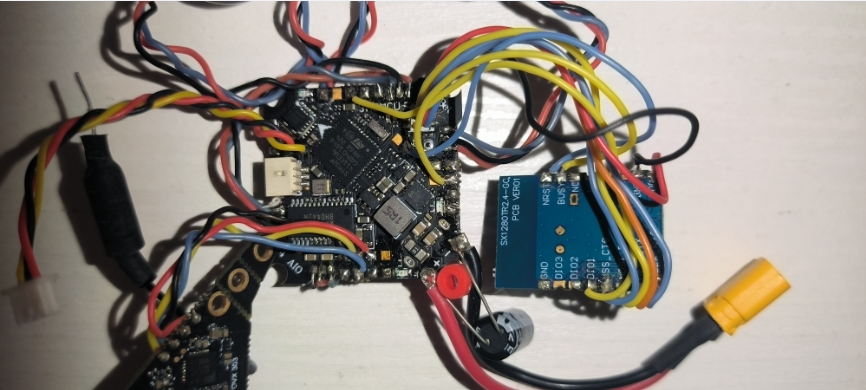

## JHEMCU Ruibet F4AIO SPI ELRS

### 固件

[JHEF411SX1280](../betaflight/obj/)

### 映射参考

| SX1280             | F411      | old define                  | new define                  |
| ------------------ | --------- | --------------------------- | --------------------------- |
| SCK(SCL / SCK_RST) | PB13      | SPI2_SCK_PIN                | SPI2_SCK_PIN                |
| MISO               | PB14      | SPI2_SDI_PIN                | SPI2_SDI_PIN                |
| MOSI               | PB15      | SPI2_SDO_PIN                | SPI2_SDO_PIN                |
| CS(NSS_CTS)        | PB2       | FLASH_CS_PIN                | RX_SPI_CS_PIN               |
| BUSY               | PB1 / PA3 | ADC_RSSI_PIN / UART2_RX_PIN | RX_SPI_EXPRESSLRS_BUSY_PIN  |
| NRESET(NRST)       | PB9       | I2C1_SDA_PIN                | RX_SPI_EXPRESSLRS_RESET_PIN |
| DIO1               | PA15      | LED_STRIP_PIN               | RX_SPI_EXTI_PIN             |


如果使用了 `UART2_RX_PIN` 需要在 cli 修改映射:

```shell
resource SERIAL_RX 2 none 
resource RX_SPI_EXPRESSLRS_BUSY 1 A03
save
```


