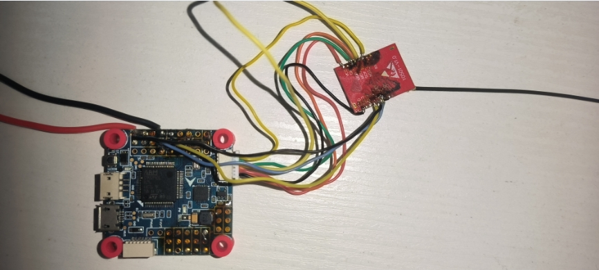

## OMNIBUS F405 V3 SPI ELRS

> 目前存在RSSI稳定性问题，不清楚是什么原因，总提示RSSI信号弱

使用默认SPI口连接SX1280

### 固件

### 映射参考

| SX1280             | F411 | old define     | new define                  |
| ------------------ | ---- | -------------- | --------------------------- |
| SCK(SCL / SCK_RST) | PC10 | SPI3_SCK_PIN   | SPI3_SCK_PIN                |
| MISO               | PC11 | SPI3_SDI_PIN   | SPI3_SDI_PIN                |
| MOSI               | PC12 | SPI3_SDO_PIN   | SPI3_SDO_PIN                |
| CS(NSS_CTS)        | PD2  | RX_SPI_CS      | RX_SPI_CS_PIN               |
| BUSY               | PA10 | UART1_RX_PIN   | RX_SPI_EXPRESSLRS_BUSY_PIN  |
| NRESET(NRST)       | PA9  | UART1_TX_PIN   | RX_SPI_EXPRESSLRS_RESET_PIN |
| EXIT(DIO1)         | A00  | ADC_RSSI       | RX_SPI_EXTI_PIN             |
| LED                | PB5  | RX_SPI_LED_PIN |                             |

